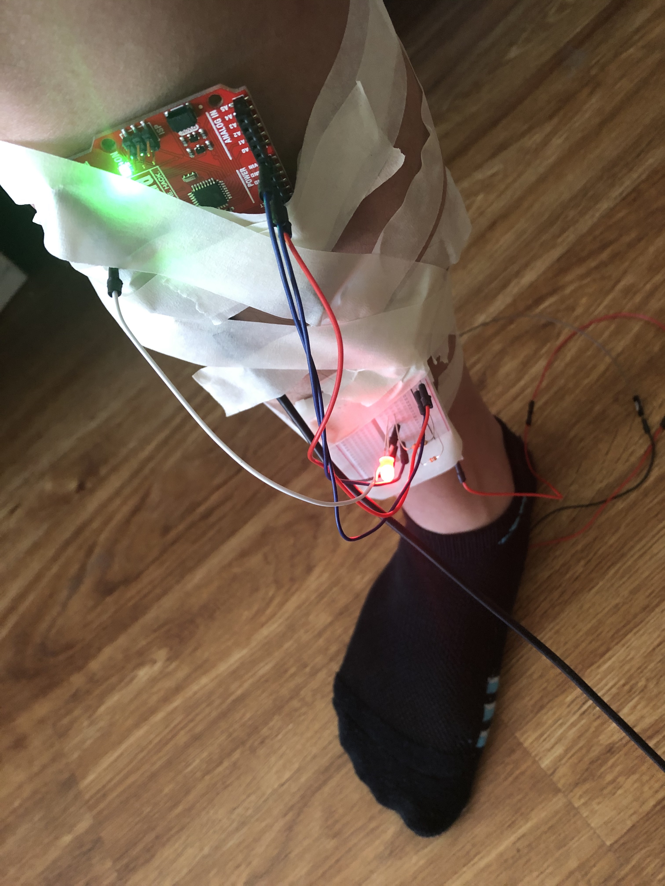
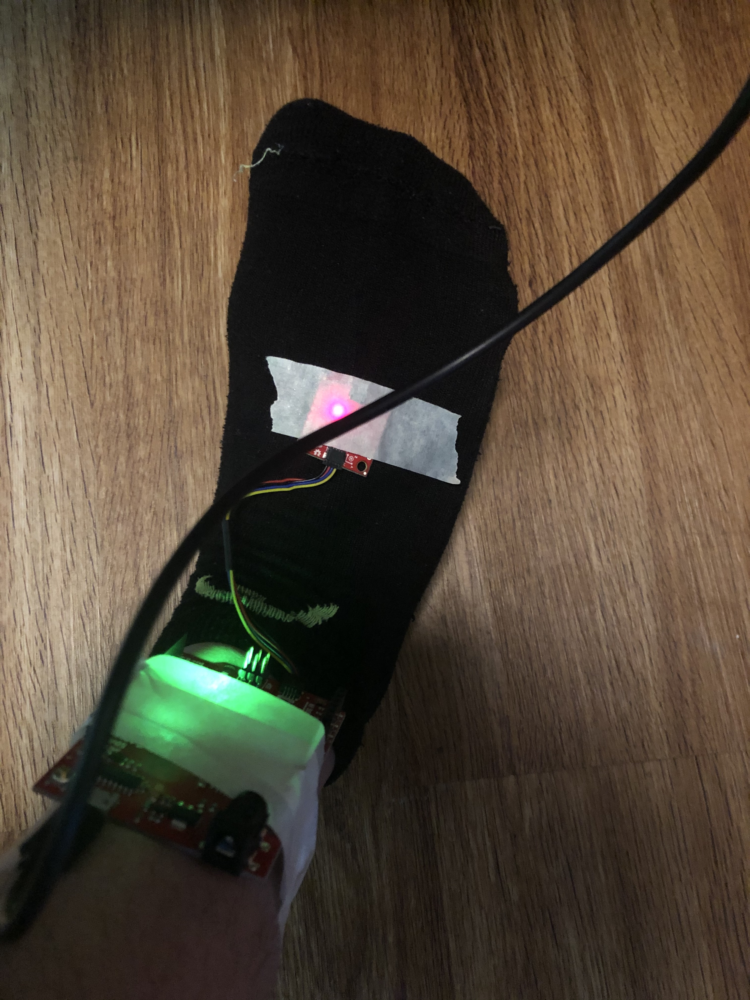

# EIT "Force" Pedometer

_Project created for the [Engineering Interactive Technologies](https://seongkookheo.com/cs4501-spring2021/) course at the Univesrity of Virginia, taught by [Professor Seongkook Heo](https://seongkookheo.com/)_

### Documentation
---
- [Pedometer Writeup](https://www.overleaf.com/read/vgqfjfzfshpm)
- [Game Controller Writeup](https://www.overleaf.com/read/ntcwgxdhwvww)

### Contributors
---
- Nidhi Manu (@NidhiManu)
- Alan Wang (@yaoeh)
